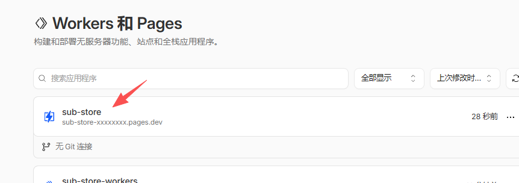
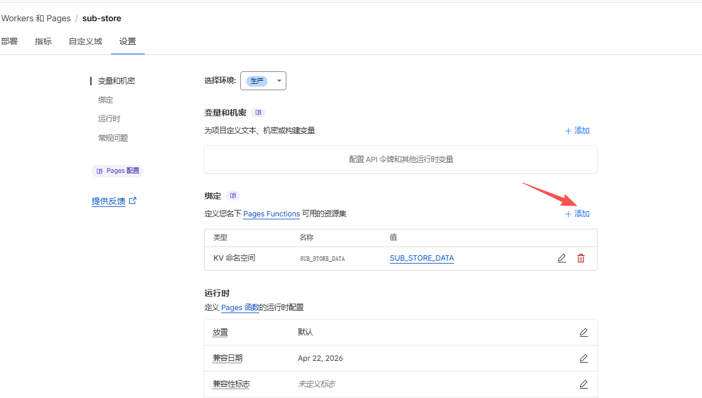
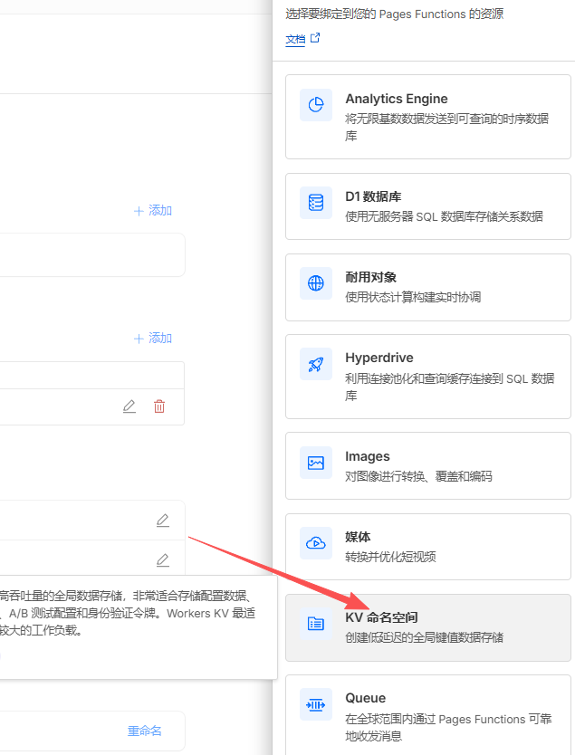
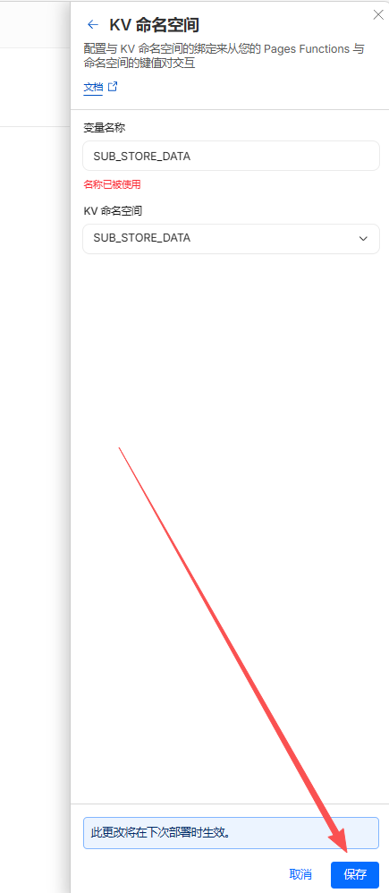
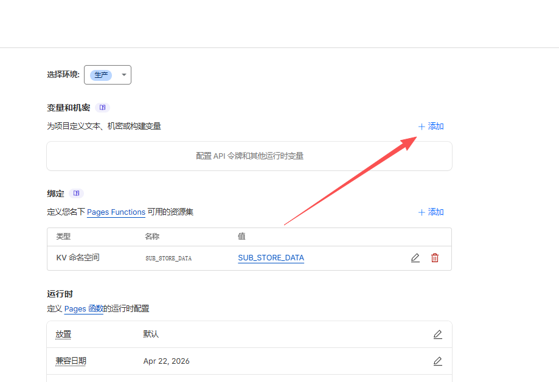

<div align="center">
<br>

<br>
<br>
<h2 align="center">Sub-Store Workers</h2>
</div>

<p align="center" color="#6a737d">
Sub-Store 后端的 Cloudflare Workers 移植版
</p>

<p align="center">
<a href="https://deploy.workers.cloudflare.com/?url=https://github.com/Yu9191/sub-store-workers">

</a>
</p>

> ⚠️ 一键部署仅创建 Workers，部署后仍需手动创建 KV 命名空间并绑定，详见下方[部署步骤](#部署)。

## 简介

将 [Sub-Store](https://github.com/sub-store-org/Sub-Store) 后端部署到 Cloudflare Workers / Pages，无需服务器，免费使用。

- **零服务器**：运行在 Cloudflare 边缘网络
- **KV 持久化**：数据存储在 Cloudflare KV
- **完整功能**：复用原始后端全部业务逻辑（订阅管理、格式转换、下载、预览等）
- **预编译解析器**：peggy 文法在构建时编译，避免运行时 eval()

## 架构

```
sub-store-workers/src/        ← Workers 适配层（6 个文件）
Sub-Store/backend/src/        ← 原始后端源码（直接复用）
esbuild.js                    ← 构建脚本，通过插件桥接两者
```

仅替换了平台相关层，核心逻辑零修改：

| Workers 文件 | 作用 |
|---|---|
| `vendor/open-api.js` | KV 替换 fs，fetch 替换 undici |
| `vendor/express.js` | Workers fetch handler 替换 Node express |
| `core/app.js` | 导入 Workers 版 OpenAPI |
| `utils/env.js` | 环境检测 |
| `restful/token.js` | 允许 Workers 签发 token |
| `index.js` | Workers 入口 |

## 部署

### 1. 克隆仓库

```bash
# 目录结构必须如下：
# parent/
#   ├── Sub-Store/          ← 原始后端源码
#   └── sub-store-workers/  ← 本项目

git clone https://github.com/sub-store-org/Sub-Store.git
git clone https://github.com/Yu9191/sub-store-workers.git

cd sub-store-workers
npm install
```

### 2. 登录 Cloudflare

```bash
npx wrangler login
```

### 3. 创建 KV 命名空间

```bash
npx wrangler kv namespace create SUB_STORE_DATA
```

将返回的 `id` 填入 `wrangler.toml`：

```toml
[[kv_namespaces]]
binding = "SUB_STORE_DATA"
id = "你的KV命名空间ID"
```

### 4. 构建 & 部署

**两者都需要部署：**

| 部署方式 | 域名 | 用途 |
|---|---|---|
| **Workers** | `*.workers.dev` 或自定义域名 | API + Cron 定时同步 |
| **Pages** | `*.pages.dev` | API（国内可直连） |

- 有自定义域名：绑到 Workers，只用 Workers 即可
- 无自定义域名：Pages 对外提供 API，Workers 跑 Cron（服务端执行，不受墙影响）

```bash
# Workers 部署（含 Cron Triggers）
npm run deploy

# Pages 部署（国内可用，一条命令）
npm run deploy:pages
```

> Pages 部署需要在 Cloudflare Dashboard 中手动绑定 KV，步骤如下：

**① 进入 Workers & Pages，点击 sub-store 项目**



**② 进入 设置 → 绑定，点击 + 添加**



**③ 选择 KV 命名空间**



**④ 变量名填 `SUB_STORE_DATA`，选择对应 KV，保存**



> 保存后需要重新部署一次才能生效。

### 5. 为什么需要 Pages？

`workers.dev` 域名在国内被 GFW 封锁，无法直接访问。`pages.dev` 走 Cloudflare CDN 网络，与大量正常网站共用 IP 段，国内通常可直连。

- **有自定义域名**：绑到 Workers 即可，不需要 Pages
- **无自定义域名**：Pages 对外提供 API，Workers 在后台跑 Cron 定时同步（服务端执行，不受墙影响）

### 6. 连接前端

打开 [Sub-Store 前端](https://sub-store.vercel.app)，后端地址填你的 Workers/Pages URL。

### 7. API 鉴权（可选）

默认 API 无密码保护。配置路径前缀后，只有知道密码的人才能管理：

在 `wrangler.toml` 中取消注释并设置：

```toml
[vars]
SUB_STORE_FRONTEND_BACKEND_PATH = "/你的密码"
```

前端后端地址填：`https://xxx.pages.dev/你的密码`

> ⚠️ `wrangler.toml` 的 `[vars]` 仅对 Workers 生效。**Pages 需要在 Dashboard 手动添加环境变量**：

**⑤ 进入 设置 → 变量和机密，点击 + 添加**



**⑥ 变量名填 `SUB_STORE_FRONTEND_BACKEND_PATH`，值填 `/你的密码`（注意必须带 `/` 开头，如 `/woain`），保存**


> 保存后重新部署 `npm run deploy:pages` 才能生效。

> 分享链接（download/preview）不受影响，无需密码即可访问。

### 8. 推送通知（可选）

支持 Bark、Pushover 等 HTTP URL 推送方式。在 `wrangler.toml` 中配置：

```toml
[vars]
SUB_STORE_PUSH_SERVICE = "https://api.day.app/你的BarkKey/[推送标题]/[推送内容]"
```

> ⚠️ Pages 同样需要在 Dashboard 手动添加 `SUB_STORE_PUSH_SERVICE` 环境变量。

> 不支持 shoutrrr（命令行工具）。

### 环境变量

| 变量 | 说明 | 必填 |
|---|---|---|
| `SUB_STORE_FRONTEND_BACKEND_PATH` | API 路径前缀密码，如 `/mySecret` | 否 |
| `SUB_STORE_PUSH_SERVICE` | HTTP URL 推送地址 | 否 |

## 本地开发

```bash
npm run dev
```

访问 `http://127.0.0.1:3000`。

## esbuild 插件

| 插件 | 作用 |
|---|---|
| `路径别名解析` | 解析 `@/` 导入，优先 Workers 覆盖 |
| `eval 重写` | 将 eval() 调用替换为静态表达式 |
| `peggy 预编译` | 构建时编译 PEG 文法，消除运行时 eval |
| `Node 模块存根` | 存根 fs/crypto 等不可用模块 |

## Cron 定时同步

Workers 版内置了 Cron Trigger，默认每天 **23:55（北京时间）** 自动同步 artifacts 到 Gist。

可在 `wrangler.toml` 修改频率：

```toml
[triggers]
crons = ["55 15 * * *"]  # UTC 时间，+8 即北京时间
```

> 前提：在前端 Settings 中配置好 GitHub 用户名和 Gist Token。

## 不支持的功能（Node 专属，Workers 无法实现）

| 功能 | 原因 |
|---|---|
| 前端静态文件托管 | 需要 `express.static` + `fs`，无本地文件系统 |
| 前端代理中间件 | 需要 `http-proxy-middleware`，Node 专属 |
| MMDB IP 查询 | 需要读取本地 MMDB 文件（`@maxmind/geoip2-node`） |
| MMDB 定时下载 | 需要 `fs.writeFile` 写入本地文件 |
| DATA_URL 启动恢复 | 需要 Node `fs` 写文件 |
| Gist 备份定时下载 | 从 Gist 下载恢复备份的 Cron（手动触发仍可用） |
| `ip-flag-node.js` 脚本 | 依赖本地 MMDB，可用 `ip-flag.js`（HTTP API）替代 |
| jsrsasign TLS 指纹 | 全局作用域限制 |
| shoutrrr 推送 | 需要 `child_process` 执行命令行工具 |
| 代理请求 | Workers 出站走 Cloudflare 网络，不支持自定义 HTTP/SOCKS5 代理 |

## ⚠️ Workers 平台限制

| 限制 | 说明 |
|---|---|
| **请求超时 30 秒** | 单次请求墙钟时间上限 30 秒，订阅源响应慢会超时失败 |
| **出站 IP 为境外** | 从 Cloudflare 节点拉取订阅，部分限制国内 IP 的订阅源无法拉取 |
| **推送通知** | 仅支持 HTTP URL 方式（Bark、Pushover 等），不支持 shoutrrr |

> 如果你的订阅源限制国内访问或响应较慢，建议使用 VPS 自建 Node.js 版本。

## FAQ

**Q: 前端提示 `找不到 Sub-Store Artifacts Repository`**
A: 正常现象，你还没创建同步配置。创建第一个同步后会自动生成。

**Q: 拉取订阅超时**
A: Workers 单次请求上限 30 秒。如果订阅源响应慢，会超时失败。可尝试换一个订阅链接。

**Q: 某些订阅源返回空或报错**
A: Workers 出站 IP 为境外 Cloudflare 节点，部分限制国内 IP 的订阅源无法拉取。

**Q: 如何更新到最新版？**
A: 见下方[同步原始仓库更新](#同步原始仓库更新)。

## KV 读写优化

Cloudflare KV 免费额度：读 10 万次/天，**写 1000 次/天**。

本项目已实现两层优化：

- **脏标记**：仅在调用 `$.write()` / `$.delete()` 时标记脏位，纯读请求不触发写入
- **内容对比**：写入前将当前数据与加载时的快照对比，内容相同则跳过写入（防止 `$.write()` 写回相同数据）
- **边缘缓存**：KV 读取设置 60 秒 `cacheTtl`，短时间内多次请求命中边缘缓存，不计入 KV 读次数

| 操作 | KV 读 | KV 写 |
|---|---|---|
| 打开前端浏览数据（~8 个请求） | 1 次（其余命中缓存） | 0 次 |
| 修改订阅/设置 | 0~1 次 | 1 次 |
| Cron 定时同步 | 1 次 | 1 次 |

个人使用完全不用担心超额。

## 同步原始仓库更新

本项目不会自动同步 Sub-Store 原始仓库的更新。当原始仓库有新版本时，手动执行：

```bash
cd Sub-Store
git pull

cd ../sub-store-workers
npm run deploy
```

esbuild 构建时会从 `Sub-Store/backend/src/` 读取最新源码，重新 build 即可包含新功能。

## 致谢

基于 [Sub-Store](https://github.com/sub-store-org/Sub-Store) 项目，感谢原作者及所有贡献者。

## 许可证

GPL V3
